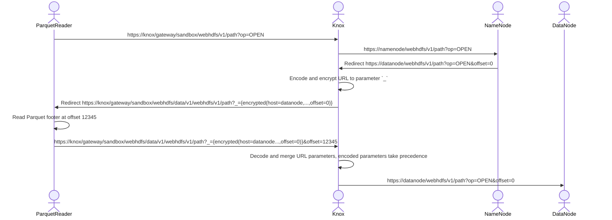

# Knox Offset issue

```mermaid
sequenceDiagram
        actor ParquetReader
        actor Knox
        actor NameNode
        actor DataNode
        ParquetReader->>Knox: https://knox/gateway/sandbox/webhdfs/v1/path?op=OPEN
        Knox->>NameNode: https://namenode/webhdfs/v1/path?op=OPEN
        NameNode->>Knox: Redirect https://datanode/webhdfs/v1/path?op=OPEN&offset=0
        Knox->>Knox: Encode and encrypt URL to parameter `_`
        Knox->>ParquetReader: Redirect https://knox/gateway/sandbox/webhdfs/data/v1/webhdfs/v1/path?_={encrypted(host=datanode,...,offset=0)}
        ParquetReader->>ParquetReader: Read Parquet footer at offset 12345
        ParquetReader->>Knox: https://knox/gateway/sandbox/webhdfs/data/v1/webhdfs/v1/path?_={encrypted(host=datanode...,offset=0)}&offset=12345
        Knox->>Knox: Decode and merge URL parameters, encoded parameters take precedence
        Knox->>DataNode: https://datanode/webhdfs/v1/path?op=OPEN&offset=0
```
